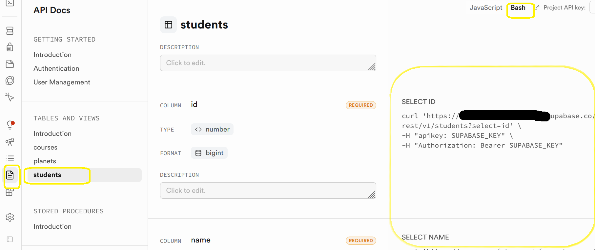
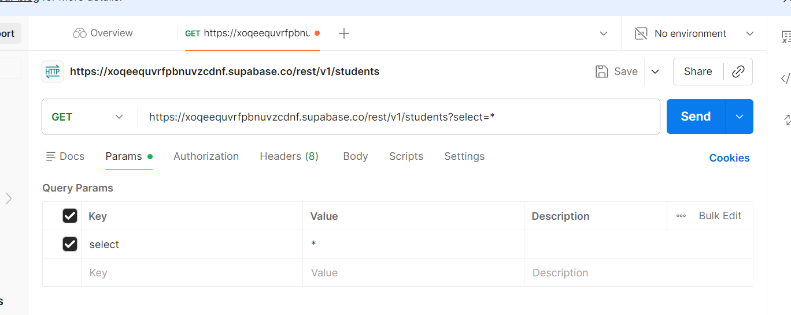
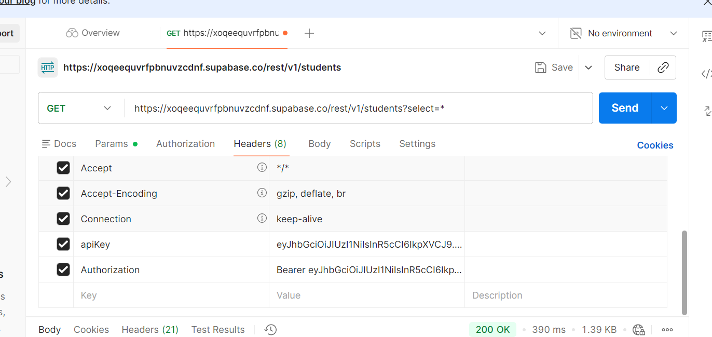
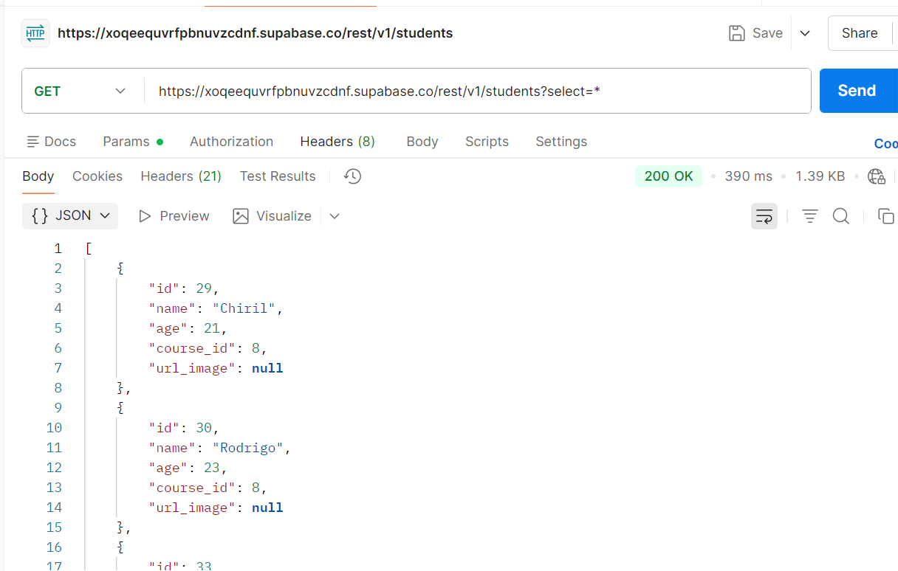

  &nbsp;&nbsp; &nbsp;&nbsp;&nbsp;&nbsp;&nbsp;&nbsp;  

<br>
<br>


# Tema 10. API REST

[*1. Introducción.*](#_apartado1)

[*2. API REST utilizada. Comarcas*](#_apartado2)

[*3. Creación y Organización del Proyecto*](#_apartado3)

[*4. Creación de la Clase Comarca*](#_apartado4)

[*5. Creación del Controlador.*](#_apartado5)

[*6. Formulario*](#_apartado6)

[*7. The Movie DataBase*](#_apartado7)

[*8. Acceso a Supabase mediante API Rest*](#_apartado8)


<br>
<br>

# <a name="_apartado1"></a>1. Introducción.

En el tema anterior hemos trabajado con acceso a datos en la nube utilizando **Supabase**.
En ese caso, utilizábamos una **librería** que nos permitía obtener objetos directamente desde la base de datos.

Sin embargo, internamente, **Supabase utiliza una API REST** para comunicarse con la base de datos.

En este tema vamos a aprender qué es una API REST y cómo acceder a ella directamente, realizando peticiones HTTP y trabajando con los datos en formato JSON.

Es decir, vamos a pasar de utilizar una capa que oculta la comunicación, a **entender y controlar cómo se realiza realmente**.

---

Podemos entender una API REST como un intermediario entre nuestra aplicación y una fuente de datos:

- Nuestra aplicación (cliente) realiza una petición
- La API (servidor) procesa esa petición
- Y devuelve la información en formato JSON

Por ejemplo:

Cliente → "Dame las comarcas de Alacant"  
API → devuelve una lista de comarcas en formato JSON

---

Una API REST es una interfaz de comunicación entre sistemas de información que utiliza el protocolo HTTP para obtener datos o ejecutar operaciones sobre ellos. Estos datos se suelen representar en formatos como JSON o XML.

En este tema vamos a centrarnos en el uso más básico: **realizar peticiones GET** para obtener información desde una API.

Vamos a empezar de manera práctica accediendo a una API REST desde un formulario en Visual Studio.

<br>
<br>

# <a name="_apartado2"></a>2. API REST utilizada. Comarcas

Antes de empezar a programar, vamos a analizar qué datos nos devuelve una API REST y qué formato tienen.

Para ello, vamos a utilizar una API muy sencilla que devuelve información sobre provincias y comarcas de la Comunidad Valenciana.

Por ejemplo, si escribimos en el navegador la siguiente dirección:

<https://node-comarques-rest-server-production.up.railway.app/api/comarques/provincies>

obtenemos una respuesta en formato JSON con las provincias disponibles:


---

### ¿Qué estamos viendo?

La API nos está devolviendo **datos en formato JSON**, que es un formato de texto estructurado muy utilizado para intercambiar información.

---

### Peticiones con parámetros 

Las APIs REST suelen permitir modificar la información que pedimos mediante parámetros en la URL.  
En nuestro caso, podemos pedir las comarcas de una provincia concreta añadiendo su nombre al final de la dirección:

<https://node-comarques-rest-server-production.up.railway.app/api/comarques/comarquesAmbImatge/Alacant>

<https://node-comarques-rest-server-production.up.railway.app/api/comarques/comarquesAmbImatge/València>

<https://node-comarques-rest-server-production.up.railway.app/api/comarques/comarquesAmbImatge/Castelló>


### Estructura de los datos

Si observamos el JSON, vemos que cada elemento contiene información como:

- nom → nombre de la comarca
- img → enlace a una imagen

Es decir, la API devuelve una lista de objetos.
Por ejemplo, un elemento sería:

```json
{
  "nom": "L'Alacantí",
  "img": "https://..."
}
```

<br>
<br>

# <a name="_apartado3"></a>3. Creación y Organización del Proyecto

En este apartado vamos a empezar a crear nuestro proyecto e ir organizando para poder acceder a la API.

Seguiremos una estructura similar a la del tema anterior, reutilizando el patrón MVC (Modelo - Vista - Controlador), aunque en este caso los datos no provienen de una base de datos, sino de una API REST.

Una vez creado el proyecto vamos a crear, en el Explorador de Soluciones, tres carpetas (**Models, Controllers y Views**).

En la carpeta **Views** meteremos los ficheros relacionados con interfaz.

En la carpeta **Models** crearemos las clases que nos permitan recuperar la información de la API.

En la carpeta **Controllers** meteremos aquellos elementos que nos sirvan como controlador o enlace entre los datos (el modelo) y la interfaz.


<br>

Vamos, en este apartado a empezar a crear la interfaz de nuestro Formulario.

Para ello, en nuestro formulario vamos a meter los siguientes controles:

- Un **comboBox** en el que posteriormente tendremos el nombre de las tres provincias (Alacant, València y Castelló). Le llamaremos `cmbProvincias`.
- Un **listBox** en el que introduciremos la lista de nombres de las comarcas pertenecientes a la provincia que elijamos. Se llamará `lsbComarcas`.
- Además, tendremos un **label** y un **linkLabel** en el que mostraremos el nombre de la comarca y un enlace a su imagen cuando elijamos una comarca en la lista.  `lblNombreComarca` y `lnkImagen`.

Tendrá un aspecto similar al siguiente:


<br>
<br>

# <a name="_apartado4"></a>4. Creación de la Clase Comarca

A continuación, vamos a crear **el modelo de datos** que nos permitirá cargar los datos de la API y trabajar con ellos.

Flujo que vamos a seguir:

**API → devuelve JSON → lo deserializamos → objetos C#**

Para ello abrimos en nuestro navegador la petición a la API, por ejemplo, con la provincia de Alacant:

<https://node-comarques-rest-server-production.up.railway.app/api/comarques/comarquesAmbImatge/Alacant>

Apareciendo en nuestro navegador el JSON con los datos solicitados.

Si pulsamos en Datos sin procesar nos aparece:


Si observamos el JSON, vemos que cada comarca tiene una estructura como:

- nom → nombre
- img → enlace a la imagen

Por tanto, **nuestra clase debe tener propiedades con esos mismos nombres**.

En este momento **seleccionamos y copiamos** un elemento individual (correspondería a una sola comarca):


En nuestro navegador nos vamos a la [página JsonToCSharp](https://json2csharp.com/) y en ella **pegamos** y pulsamos Convertir:


De esta manera obtenemos la clase que luego utilizaremos. 

Nos vamos a nuestra carpeta *Models* y en ella creamos una nueva Clase que llamaremos `Comarca` y que adaptaremos con el código que hemos obtenido en la página anterior:

```csharp
namespace _01ApiComarcas.Models
{
    public class Comarca
    {
        public string nom { get; set; }
        public string img { get; set; }
    }
}
```

<br>

💡 Nota:

Las propiedades de la clase tienen el mismo nombre que los campos del JSON (`nom`, `img`).  
Esto permite que la conversión (deserialización) se realice automáticamente.

En otros casos, cuando los nombres no coinciden, se pueden utilizar anotaciones para mapear los datos, como vimos en el tema anterior con Supabase.

A partir de ahora, cada vez que trabajemos con una API REST, seguiremos este mismo proceso:

1. Analizar el JSON que devuelve la API
2. Crear una clase que represente esos datos
3. Convertir el JSON en objetos de C#

Este patrón se repetirá en los siguientes ejemplos.

<br>
<br>

# <a name="_apartado5"></a>5. Creación del Controlador.

En este apartado vamos a crear la clase **ComarcasController**, dentro de la carpeta Controllers.

En este caso no utilizamos un repositorio como en el tema anterior, ya que el propio controlador se encarga de acceder directamente a la API.

En aplicaciones más complejas sí podría existir una capa adicional, pero para simplificar trabajaremos directamente desde el controlador.

Tendrá el siguiente código:

```csharp
public class ComarcasController
{
    // Variable local que nos permite realizar 
    // solicitudes HTTP
    private HttpClient _httpClient;

    // Constructor
    public ComarcasController()
    {
        _httpClient = new HttpClient();
    }
         
    // Método asíncrono que realiza la petición a la API
    public async Task<List<Comarca>> GetComarcas(String provincia)
    {
        try
        {
            // 1. Realizamos la petición HTTP a la API
            string url = "https://node-comarques-rest-server-production.up.railway.app/api/comarques/comarquesAmbImatge/" + provincia;
            HttpResponseMessage response = await _httpClient.GetAsync(url);

            // 2. Comprobamos si la respuesta es correcta
            response.EnsureSuccessStatusCode();

            // 3. Obtenemos el JSON como texto
            string responseJSON = await response.Content.ReadAsStringAsync();

            // 4. Convertimos (deserializamos) el JSON a objetos C#
            List<Comarca> listaComarcas = JsonConvert.DeserializeObject<List<Comarca>>(responseJSON);

            return listaComarcas;
        }
        catch (Exception ex)
        {
            Console.WriteLine("Error al llamar a la API: " + ex.Message);
            return null;
        }
    }
}
```

---
💡 Nota:

En aplicaciones reales, *HttpClient* suele reutilizarse y no crearse muchas veces, pero para simplificar el aprendizaje en este ejemplo lo creamos en el constructor.

---

Para poder utilizar JsonConvert, que nos aparece con error, debemos instalar **NewtonSoft.Json**. Para ello pulsamos Alt + Intro e instalamos el paquete:


Como podemos ver en el código, lo que estamos haciendo es una petición http que nos devuelve una respuesta (`response`).

Si la respuesta ha sido correcta, obtenemos un string con el JSON (`responseJSON`), y la deserializamos para obtener la lista de Comarcas.

### 🔄 Flujo de trabajo

En este método estamos siguiendo siempre el mismo proceso:

1. Realizar una petición HTTP a la API (`GetAsync`)
2. Comprobar que la respuesta es correcta
3. Leer el contenido de la respuesta (JSON)
4. Convertir ese JSON a objetos de C#

Es decir:

API → JSON (string) → objetos (List<Comarca>)

---

### 🔗 Relación con el tema anterior

Si comparamos con el tema anterior:

- Antes utilizábamos un repositorio que accedía a Supabase
- Ahora realizamos una petición HTTP directamente a una API

En ambos casos, el objetivo es el mismo: obtener datos y trabajar con ellos como objetos en C#


<br>
<br>

# <a name="_apartado6"></a>6. Interfaz

Vamos, por último, a ver el código que **escribimos en nuestro formulario** para poder ver las comarcas de las distintas provincias.

En primer lugar, vamos a hacer un subprograma, que posteriormente llamaremos en `FormLoad` para rellenar el comboBox de provincias:

```csharp
private void cargarProvincias()
{
    String[] listaProvincias = { "Alacant", "València", "Castelló" };

    // Inicializamos el combo con el vector de provincias
    cmbProvincias.Items.AddRange(listaProvincias);
    cmbProvincias.SelectedIndex = 0;
}
```

A continuación, creamos una lista de comarcas en el formulario (accesible desde todos los puntos del mismo) y un método para cargar, utilizando un objeto de tipo controlador, la lista de comarcas, a partir del nombre de la provincia:

```csharp
private async void cargarComarcas(String provincia)
{
    _listaComarcas = await _comarcasController.GetComarcas(provincia);
    
    if (_listaComarcas == null)
    {
        MessageBox.Show("Error al cargar las comarcas.");
        return;
    }

    // Cargamos en el listBox el nombre de las comarcas
    lsbComarcas.Items.Clear();
    foreach (Comarca comarca in _listaComarcas)
    {
        lsbComarcas.Items.Add(comarca.nom);
    }
    
    if (_listaComarcas.Count > 0)
    {
        lsbComarcas.SelectedIndex = 0;
    }
}
```

<br>

---

### Programación Asíncrona.

Repasamos brevemente el concepto de programación asíncrona que ya vimos en el tema 9:

Como vemos en la definición de la función anterior aparece la palabra reservada `async`. Esto hace que esa función se ejecute de manera **asíncrona**. 

Cuando consumimos un recurso externo a nuestro código (un fichero, una BD, un servicio online…), este puede tardar y retardar o incluso bloquear nuestra aplicación.

Cuando utilizamos `async` y `await`, permitimos que la aplicación no se bloquee mientras espera la respuesta de un recurso externo.

Por ejemplo, al llamar a una API:
- La petición puede tardar unos segundos
- Gracias a `await`, la interfaz sigue respondiendo
- Cuando llega la respuesta, el método continúa su ejecución

Esto es especialmente importante en interfaces gráficas, ya que evita que la aplicación se “congele”.

Es importante que **toda la cadena de llamadas sea asíncrona**, por eso el método `comarcasController.GetComarcas` que es asíncrono es llamada con la palabra reservada `await`.

La palabra reservada `await` hace que el resto del código **dentro de la función asíncrona** espere a la respuesta de esa línea de código, y nosotros al poner async a nuestra función estamos asegurando el asincronimso en todo el hilo de acontecimientos.

---

[Utilización de async y await](https://www.campusmvp.es/recursos/post/async-y-await-en-c-como-manejar-asincronismo-en-net-de-manera-facil.aspx)

[Operador await en C#](https://learn.microsoft.com/es-es/dotnet/csharp/language-reference/operators/await)

<hr>

<br>

### 🔄 Flujo de la aplicación

El funcionamiento del formulario es el siguiente:

1. Al iniciar la aplicación, se cargan las provincias en el comboBox
2. Cuando el usuario selecciona una provincia:
   - Se realiza una llamada a la API
   - Se obtiene la lista de comarcas
   - Se muestran en el listBox
3. Cuando el usuario selecciona una comarca:
   - Se muestra su nombre
   - Se muestra el enlace a la imagen

De esta forma, la interfaz responde a las acciones del usuario y actualiza los datos dinámicamente.

Para poder cargar las comarcas dependiendo de la provincia elegida en el `comboBox`, llamaremos a esa función a través del evento `selectedIndexChanged`:


Como podemos ver si ejecutamos el programa, cuando cambiamos la provincia en el `comboBox` obtenemos en el `listBox` la lista de comarcas correspondientes.

Vamos, para finalizar el programa, a obtener en nuestro formulario (en `label` y `linkLabel` habilitados para ello) el nombre de la comarca y su imagen cuando la elijamos en el listBox de comarcas.

Hacemos una función que mostrará la comarca de una posición determinada y la llamaremos en el evento `SelectedIndexChanged` del listBox de comarcas:

```csharp
private void mostrarComarca(int pos)
{
    lblNombreComarca.Text = _listaComarcas[pos].nom;

    lnkImagen.Text = _listaComarcas[pos].img;

}

private void lsbComarcas_SelectedIndexChanged(object sender, EventArgs e)
{
    if (lsbComarcas.SelectedIndex >= 0)
    {
        mostrarComarca(lsbComarcas.SelectedIndex);
        lnkImagen.LinkVisited = false;
    }
}
```


Si queremos navegar al enlace de la imagen que aparece lo podemos hacer con el evento Click de linkLabel:

```csharp
private void lnkImagen_LinkClicked(object sender, LinkLabelLinkClickedEventArgs e)
{
    try
    {
        // Indicamos que lo hemos visitado
        lnkImagen.LinkVisited = true;
        // Abrimos navegador
        //System.Diagnostics.Process.Start(lnkImagen.Text);
        Process.Start(new ProcessStartInfo
        {
            FileName = lnkImagen.Text,
            UseShellExecute = true
        });

    }
    catch (Exception ex)
    {
        MessageBox.Show("Unable to open link that was clicked.");
    }
}

```


Código completo del formulario:
```csharp
public Form1()
{
    InitializeComponent();
}

private List<Comarca> _listaComarcas;
ComarcasController _comarcasController = new ComarcasController();

private void Form1_Load(object sender, EventArgs e)
{
    cargarProvincias();
}

private void cargarProvincias()
{
    String[] listaProvincias = { "Alacant", "València", "Castelló" };

    // Inicializamos el combo con el vector de provincias
    cmbProvincias.Items.AddRange(listaProvincias);
    cmbProvincias.SelectedIndex = 0;
}

private async void cargarComarcas(String provincia)
{
    _listaComarcas = await _comarcasController.GetComarcas(provincia);

    if (_listaComarcas == null)
    {
        MessageBox.Show("Error al cargar las comarcas.");
        return;
    }
    
    lsbComarcas.Items.Clear();

    foreach (Comarca comarca in _listaComarcas)
    {
        lsbComarcas.Items.Add(comarca.nom);
    }

    if (_listaComarcas.Count > 0)
    {
        lsbComarcas.SelectedIndex = 0;
    }
}

private void cmbProvincias_SelectedIndexChanged(object sender, EventArgs e)
{
    cargarComarcas(cmbProvincias.Text);
}

private void mostrarComarca(int pos)
{
    lblNombreComarca.Text = _listaComarcas[pos].nom;

    lnkImagen.Text = _listaComarcas[pos].img;
}

private void lsbComarcas_SelectedIndexChanged(object sender, EventArgs e)
{
    if (lsbComarcas.SelectedIndex >= 0)
    {
        mostrarComarca(lsbComarcas.SelectedIndex);
        lnkImagen.LinkVisited = false;
    }
}

private void lnkImagen_LinkClicked(object sender, LinkLabelLinkClickedEventArgs e)
{
    try
    {
        // Indicamos que lo hemos visitado
        lnkImagen.LinkVisited = true;
        // Abrimos navegador
        Process.Start(new ProcessStartInfo
        {
            FileName = lnkImagen.Text,
            UseShellExecute = true
        });

    }
    catch (Exception ex)
    {
        MessageBox.Show("Unable to open link that was clicked.");
    }
}

// TODO: Faltaría implementar este código por el alumno 
/*private async void mostrarInfoComarca()
{
    ComarcaInfo comarcaInfo = await _comarcasController.GetComarcaInfo(lblNombreComarca.Text);

    MessageBox.Show(comarcaInfo.ToString());
}

private void btnInfoComarca_Click(object sender, EventArgs e)
{
    mostrarInfoComarca();
}*/
```

💡 Observación:

En este apartado vemos cómo la interfaz (View) se comunica con el controlador, que es el que realiza la petición a la API.

No accedemos directamente a la API desde la interfaz, lo que mantiene el código organizado siguiendo el patrón MVC.


### Ejercicio

Se deja como ejercicio al alumno añadir un botón en el que según el nombre la comarca seleccionada accedamos a esta petición http obteniendo información sobre la misma:

<https://node-comarques-rest-server-production.up.railway.app/api/comarques/infoComarca/L'alacantí>

💡 Este ejercicio sigue exactamente el mismo patrón:

- Cambia la URL de la API
- Analiza el JSON que devuelve
- Crea la clase correspondiente
- Realiza la llamada desde el controlador

<br>
<br>

# <a name="_apartado7"></a>7. Api Rest The Movie DataBase

## The Movie DataBase

En el apartado anterior hemos trabajado con una API sencilla en la que el JSON se convertía directamente en una lista de objetos.

En este caso, vamos a trabajar con una API más completa, en la que:

- Se necesita una API Key para acceder
- El JSON devuelto es más complejo
- Tendremos que extraer la información que nos interesa

Aun así, el proceso general será el mismo:

API → JSON → objetos → interfaz

Esta API Rest es la de la página [The Movie DataBase](https://www.themoviedb.org/), en la que tenemos una completísima base de datos de películas y series.

Si queremos trabajar como programadores con esta API podemos empezar en la página: <https://developer.themoviedb.org/reference/intro/getting-started>, en ella aparecen a la izquierda los distintos endpoints que podemos acceder.

Uno de ellos es el de las películas ahora mismo en cartelera:

<https://developer.themoviedb.org/reference/movie-now-playing-list>.

## Api Key

Para poder trabajar con esta API Rest necesitamos una **clave o API Key**, a diferencia con la API de comarcas que trabajamos en los apartados anteriores que no la necesitaban.

Si en la página [Get Starter](https://developer.themoviedb.org/reference/intro/getting-started) pulsamos sobre el botón Get Api Key:


Nos pide que nos hagamos una cuenta y en ella tendremos que ir al apartado correspondiente:


Tendremos que copiar luego nuestra API Key para poder acceder al endpoint deseado.

## Creación y organización del proyecto

De nuevo, como en el apartado anterior, crearemos un nuevo proyecto y en el mismo, crearemos las carpetas **Models, Controllers, Views**.

Vamos a crear a continuación el formulario principal en el que vamos a visualizar nuestras películas. Tendrá un aspecto similar a este:


Siendo un elemento de tipo PictureBox el rectángulo que aparece en medio y que nos permitirá ver la portada de la película.

## Creación de la clase Película.

Vamos a crear a continuación la clase película, que al igual que hacíamos antes con las comarcas me permite trabajar con un elemento de tipo Película.

Para ello, en primer lugar vamos a ver la estructura JSON que nos devuelve la petición API a The Movie Database, con las películas en cartelera.

Para ello, lo podemos hacer en el navegador, o bien en el programa [Postman](https://www.postman.com/), utilizando la siguiente url, en la que debemos incorporar el idioma y la API_Key:

<https://api.themoviedb.org/3/movie/now_playing?api_key=API_KEY&language=es>


Vemos que el resultado JSON nos ofrece información, así como una lista de películas que es la que nos interesa (uno de sus elementos) para utilizar en [Json2CSharp](https://json2csharp.com/) para poder crear la clase **Película** en **Models**:


Debido a que el JSON contiene muchos campos, utilizaremos la herramienta para generar automáticamente la clase.

No es necesario utilizar todos los campos, pero en este caso los dejamos para poder acceder a distinta información si lo necesitamos más adelante.

Dando como resultado la clase **Models/Película**:

```csharp
public class Pelicula
{
    public bool adult { get; set; }
    public string backdrop_path { get; set; }
    public List<int> genre_ids { get; set; }
    public int id { get; set; }
    public string original_language { get; set; }
    public string original_title { get; set; }
    public string overview { get; set; }
    public double popularity { get; set; }
    public string poster_path { get; set; }
    public string release_date { get; set; }
    public string title { get; set; }
    public bool video { get; set; }
    public double vote_average { get; set; }
    public int vote_count { get; set; }
}

```

## Creación del controlador

A continuación, vamos a crear **Controllers/PeliculasController** que nos permitirá acceder a la API y obtener una lista de películas.

### 🧠 Diferencia importante en el JSON

A diferencia del ejemplo anterior, la API de The Movie Database no devuelve directamente una lista de películas.

En su lugar, devuelve un objeto JSON que contiene varias propiedades, entre ellas:

- `results`: que es la lista de películas que nos interesa

Por tanto, en este caso tendremos que acceder primero a esa propiedad para obtener la lista real.

Ponemos el código a continuación, recordando que se debe instalar el paquete **NewtonSoft.JSON**:

```csharp
public class PeliculasController
{
    // Variable local que nos permite realizar 
    // solicitudes HTTP
    private HttpClient _httpClient;

    private string _apiKey = "1bcambiarporlanuestrabf";

    public PeliculasController()
    {
        _httpClient = new HttpClient();
    }

    public async Task<List<Pelicula>> GetPeliculasNowPlaying()
    {
        try
        {
            string url = $"https://api.themoviedb.org/3/movie/now_playing?api_key={_apiKey}&language=es";

            HttpResponseMessage response = await _httpClient.GetAsync(url);

            response.EnsureSuccessStatusCode();

            string responseJSON = await response.Content.ReadAsStringAsync();

            JObject jsonObject = JObject.Parse(responseJSON);
            JArray resultsArray = (JArray)jsonObject["results"];
            List<Pelicula> peliculas = resultsArray.ToObject<List<Pelicula>>();

            return (peliculas);
        }
        catch (Exception)
        {
            Console.WriteLine("Error al obtener películas: " + ex.Message);
            return null;
        }
    }
}

```

### 🔄 Procesamiento del JSON

En este caso, el proceso es ligeramente diferente al anterior:

1. Obtenemos el JSON completo
2. Lo convertimos en un objeto (`JObject`)
3. Accedemos a la propiedad `results`
4. Convertimos esa lista a objetos `Pelicula`

Esto se debe a que el JSON no es directamente una lista, sino un objeto que contiene dicha lista.

💡 Nota:

La API Key es un identificador personal que permite a la API saber quién está realizando las peticiones.

No se debe compartir ni subir a repositorios públicos.

<br>

## Programación de la Interfaz (Formulario)

### 🔄 Flujo de la aplicación

1. Al iniciar el formulario, se realiza la llamada a la API
2. Se obtiene la lista de películas
3. Se muestra la primera película
4. El usuario puede navegar entre ellas mediante los botones
5. Cada cambio actualiza la información y la imagen

Este flujo es el mismo que en el ejemplo anterior, pero aplicado a un caso más completo.

Este sería el código que tendríamos en nuestro formulario. Se han puesto los distintos eventos del mismo:

```csharp
public Form1()
{
    InitializeComponent();
}

PeliculasController peliculasController = new PeliculasController();
List<Pelicula> listaPeliculas = null;

int _posicion = 0;

// Cliente http para mostrar imágenes
private HttpClient _httpClient = new HttpClient();

private async void obtenerPeliculasActuales()
{
    listaPeliculas = await peliculasController.GetPeliculasNowPlaying();

    if (listaPeliculas == null || listaPeliculas.Count == 0)
    {
        MessageBox.Show("No se pudieron cargar las películas.");
        return;
    }

    mostrarPelicula(_posicion);
}

// Esta función se llama cuando ya se hayan 
// Cargado las películas y carga la de pos
private async void mostrarPelicula(int pos)
{
    if (listaPeliculas == null || pos < 0 || pos >= listaPeliculas.Count)
        return;

    lblNombrePelicula.Text = listaPeliculas[pos].title;
    string size = "w500";
    string imageUrl = "https://image.tmdb.org/t/p/" + size + listaPeliculas[pos].poster_path; // Reemplaza con la URL de tu imagen

    try
    {
        byte[] imageBytes = await _httpClient.GetByteArrayAsync(imageUrl);
        using (var ms = new System.IO.MemoryStream(imageBytes))
        {
            pictureBox1.Image = System.Drawing.Image.FromStream(ms);
        }
    }
    catch (Exception ex)
    {
        MessageBox.Show("Error al cargar la imagen: " + ex.Message);
    }

}

private void Form1_Load(object sender, EventArgs e)
{
    obtenerPeliculasActuales();
}

private void btnPrimero_Click(object sender, EventArgs e)
{
    _posicion = 0;
    mostrarPelicula(_posicion);
}

private void btnAnterior_Click(object sender, EventArgs e)
{
    if (_posicion > 0)
    {
        _posicion--;
        mostrarPelicula(_posicion);
    }
}

private void btnSiguiente_Click(object sender, EventArgs e)
{
    if (_posicion < listaPeliculas.Count - 1)
    {
        _posicion++;
        mostrarPelicula(_posicion);
    }
}

private void btnUltimo_Click(object sender, EventArgs e)
{
    _posicion = listaPeliculas.Count - 1;
    mostrarPelicula(_posicion);
}

```

Se deja para el alumno la implementación del botón "Ojo" en el que podemos mostrar en un nuevo formulario los datos que nos interesen de la película actualmente seleccionada.

<br>
<br>


# <a name="_apartado8"></a>8. Acceso a Supabase mediante API REST

En el tema 9 hemos trabajado con Supabase utilizando una librería de C#, que nos permitía acceder a la base de datos de forma directa mediante objetos.

Sin embargo, como hemos visto en este tema, muchas aplicaciones se comunican con los datos a través de APIs REST.

---

💡 **Idea clave**

Supabase también proporciona una API REST automáticamente para cada una de sus tablas.

Esto significa que **no es necesario utilizar el cliente de Supabase**, 
sino que podemos acceder a los datos directamente mediante peticiones HTTP, 
igual que hemos hecho en los ejemplos anteriores.

Es decir, **lo que hacíamos en el tema 9 con el SDK, en realidad se estaba realizando 
mediante llamadas a una API REST por debajo.**

---

## Supabase como API REST

Supabase utiliza una herramienta llamada **PostgREST**, que convierte automáticamente una base de datos PostgreSQL en una API REST completa.

Esto significa que:

- Cada tabla se expone como un recurso accesible mediante una URL
- Podemos consultar los datos utilizando peticiones HTTP
- No es necesario desarrollar un backend adicional

---

Por ejemplo, si tenemos una tabla `students`, podremos acceder a ella mediante una dirección como:

GET https://TU-PROYECTO.supabase.co/rest/v1/students

---

## Métodos HTTP en Supabase

Como cualquier API REST, Supabase utiliza los métodos HTTP estándar para realizar operaciones sobre los datos:

| Método | Acción                         | Equivalente en BD |
|--------|--------------------------------|--------------------|
| GET    | Obtener datos                  | SELECT             |
| POST   | Crear un nuevo registro        | INSERT             |
| PATCH  | Actualizar un registro         | UPDATE             |
| DELETE | Eliminar un registro           | DELETE             |

En este tema nos hemos centrado únicamente en el método **GET**, que permite obtener información desde una API.

Sin embargo, como podemos ver, es posible realizar todas las operaciones sobre los datos utilizando estos métodos.

## ¿Cómo podemos ver los endpoints en Supabase?

Todos los proyectos de Supabase disponen de una API REST que podemos utilizar para consultar los datos.

Podemos encontrar la información de esta API en el panel del proyecto:

- En **Project Settings → Data API**, donde obtenemos la URL base de la API.
- En **API Docs**, donde podemos ver las distintas llamadas disponibles para cada tabla.



---

Cada tabla de nuestra base de datos se expone como un recurso.

Por ejemplo, si tenemos una tabla `students`, podremos acceder a ella mediante una URL como:

GET https://TU-PROYECTO.supabase.co/rest/v1/students

---

Podemos probar estas llamadas fácilmente en el navegador o en herramientas como **Postman**, obteniendo como resultado un JSON con los datos:



y los Headers:



obteniendo los resultados como un JSON:




<br>

## Relación con el tema anterior

En el tema 9 hemos desarrollado una aplicación utilizando Supabase a través de su librería de C#.  
Para ello utilizábamos un repositorio que encapsulaba el acceso a los datos.

Por ejemplo, para obtener los estudiantes hacíamos algo similar a:

```csharp
await _repo.GetAllAsync();
```

Internamente, este repositorio utilizaba el **cliente de Supabase** para realizar la consulta.

Sin embargo, como hemos visto en este apartado, Supabase proporciona una API REST que permite
realizar estas mismas operaciones mediante peticiones HTTP.

Es decir, en lugar de utilizar el cliente de Supabase, podemos acceder directamente a los datos mediante llamadas a la API.

---

### Idea clave:

No cambia la aplicación, únicamente cambia la forma en la que accedemos a los datos.

---

## Modificación del acceso a datos

A continuación, vamos a modificar el acceso a datos del tema anterior.

En lugar de utilizar el cliente de Supabase dentro del repositorio, vamos a realizar las peticiones directamente a la API REST.

De esta forma:

- Mantendremos el modelo de datos (`Student`)
- Mantendremos la interfaz de usuario
- Mantendremos el repositorio
- Sustituiremos el acceso a datos por llamadas HTTP

Es decir, **reutilizamos toda la aplicación anterior**, cambiando únicamente la forma en la que obtenemos los datos.

Para poder realizar las peticiones a la API REST utilizaremos la clase `HttpClient`, que nos permite realizar solicitudes HTTP desde C#.

Además, necesitaremos conocer:

- La URL de la API de Supabase
- La tabla a la que queremos acceder (`students`)
- Y la **anon key**, que utilizaremos como cabecera para poder realizar la petición

En nuestro caso, la llamada que realizaremos será equivalente a:

GET https://TU-PROYECTO.supabase.co/rest/v1/students

<br>

### Obtener estudiantes mediante API REST

Vamos a implementar un método que nos permita obtener la lista de estudiantes, 
igual que hacíamos en el tema anterior, pero utilizando directamente la API REST.

Para ello utilizaremos `HttpClient` y realizaremos una petición GET a la API de Supabase.

En este caso, **no será necesario modificar el controlador del tema anterior**, ya que seguirá utilizando el repositorio.

Lo que cambia será la **implementación del repositorio**, que en lugar de utilizar el cliente de Supabase realizará las peticiones directamente a la API REST.

## Repositorio con API REST

Vamos a modificar el repositorio del tema anterior para que, en lugar de utilizar el cliente de Supabase, realice las peticiones a la API REST utilizando `HttpClient`.

De esta forma mantenemos la misma estructura de la aplicación, cambiando únicamente la tecnología de acceso a datos.

```csharp
using System.Net.Http;
using Newtonsoft.Json;

namespace Ejemplo01Students.Repositories
{
    public class StudentsRepository
    {
        private readonly HttpClient _httpClient;

        private readonly string _projectUrl = "https://TU-PROYECTO.supabase.co/rest/v1";
        private readonly string _apiKey = "TU_ANON_KEY";

        public StudentsRepository()
        {
            _httpClient = new HttpClient();

            _httpClient.DefaultRequestHeaders.Add("apikey", _apiKey);
            _httpClient.DefaultRequestHeaders.Add("Authorization", $"Bearer {_apiKey}");
            _httpClient.DefaultRequestHeaders.Add("Accept", "application/json");
            _httpClient.DefaultRequestHeaders.Add("Prefer", "return=representation");
        }

        private void CheckResponse(HttpResponseMessage response, string operation)
        {
            if (!response.IsSuccessStatusCode)
            {
                throw new Exception(
                    $"Error en {operation}: ({(int)response.StatusCode}) {response.ReasonPhrase}"
                );
            }
        }

        public async Task<List<Student>> GetAllAsync()
        {
            try
            {
                string url = $"{_projectUrl}/students?select=*&order=id.asc";

                HttpResponseMessage response = await _httpClient.GetAsync(url);

                CheckResponse(response, "GetAllAsync");

                string json = await response.Content.ReadAsStringAsync();

                var data = JsonConvert.DeserializeObject<List<Student>>(json);

                return data ?? new List<Student>();
            }
            catch (Exception ex)
            {
                Console.WriteLine("Error al obtener estudiantes: " + ex.Message);
                return new List<Student>();
            }
        }
    }
}
```

### Funcionamiento del repositorio

En este caso, el repositorio es el encargado de realizar las peticiones HTTP a la API REST de Supabase.

El proceso es:

1. Construir la URL del recurso
2. Realizar la petición HTTP
3. Obtener la respuesta en formato JSON
4. Convertir ese JSON a objetos de C#

Es decir:

**API REST → JSON → objetos C#**

---

### Relación con el tema anterior

En el tema 9 el repositorio utilizaba el cliente de Supabase.

En este caso, el repositorio realiza directamente las peticiones HTTP a la API REST.

Sin embargo, desde el controlador no apreciamos ninguna diferencia:

```csharp
await _repo.GetAllAsync();
```

## Insertar un estudiante

Para insertar un nuevo estudiante utilizamos una petición **POST**.

En este caso:

- Creamos un objeto `Student`
- Lo convertimos a formato JSON
- Lo enviamos en el cuerpo de la petición

La API REST procesa la petición y devuelve el objeto creado, que convertimos de nuevo a nuestro modelo.

Tendríamos esta función en nuestro StudentsRepository:

```csharp
public async Task<Student?> InsertAsync(Student student)
{
    if (student is null)
        throw new ArgumentNullException(nameof(student));

    try
    {
        // Convertimos el objeto a JSON
        string json = JsonConvert.SerializeObject(student);

        var content = new StringContent(json, System.Text.Encoding.UTF8, "application/json");

        // URL de la tabla
        string url = $"{_projectUrl}/students";

        // Petición POST
        HttpResponseMessage response = await _httpClient.PostAsync(url, content);

        // Comprobamos errores
        CheckResponse(response, "InsertAsync");

        // Leemos JSON de respuesta
        string responseJson = await response.Content.ReadAsStringAsync();

        var result = JsonConvert.DeserializeObject<List<Student>>(responseJson);

        return result?.FirstOrDefault();
    }
    catch (Exception ex)
    {
        Console.WriteLine("Error al insertar estudiante: " + ex.Message);
        return null;
    }
}
```

De nuevo, no hay ningún cambio en nuestro controller:

```csharp
return await _repo.InsertAsync(student);
```

## Actualizar y eliminar estudiantes

Las operaciones de actualización y borrado siguen el mismo patrón que las anteriores, pero incorporan un elemento nuevo: el uso de filtros en la URL para indicar sobre qué registro queremos actuar.

Tendríamos los dos métodos siguientes en el repositorio:

```csharp
public async Task<Student?> UpdateAsync(Student student)
{
    if (student is null)
        throw new ArgumentNullException(nameof(student));

    if (student.Id is null || student.Id <= 0)
        throw new ArgumentOutOfRangeException(nameof(student.Id));

    try
    {
        string json = JsonConvert.SerializeObject(student);

        var content = new StringContent(json, System.Text.Encoding.UTF8, "application/json");

        string url = $"{_projectUrl}/students?id=eq.{student.Id}";

        var request = new HttpRequestMessage(new HttpMethod("PATCH"), url)
        {
            Content = content
        };

        HttpResponseMessage response = await _httpClient.SendAsync(request);

        CheckResponse(response, "UpdateAsync");

        string responseJson = await response.Content.ReadAsStringAsync();

        var result = JsonConvert.DeserializeObject<List<Student>>(responseJson);

        return result?.FirstOrDefault();
    }
    catch (Exception ex)
    {
        Console.WriteLine("Error al actualizar estudiante: " + ex.Message);
        return null;
    }
}

public async Task<bool> DeleteAsync(int id)
{
    if (id <= 0)
        throw new ArgumentOutOfRangeException(nameof(id));

    try
    {
        string url = $"{_projectUrl}/students?id=eq.{id}";

        HttpResponseMessage response = await _httpClient.DeleteAsync(url);

        CheckResponse(response, "DeleteAsync");

        return true;
    }
    catch (Exception ex)
    {
        Console.WriteLine("Error al eliminar estudiante: " + ex.Message);
        return false;
    }
}
```

Para actualizar y eliminar registros utilizamos los métodos HTTP **PATCH** y **DELETE**.

En ambos casos, la API REST utiliza filtros en la URL para indicar qué registro debemos modificar o eliminar.

Por ejemplo:

- `?id=eq.5` → indica que queremos actuar sobre el registro con id = 5

Estas operaciones siguen el mismo patrón que las anteriores:

- Convertir datos a JSON (en el caso de PATCH)
- Realizar la petición HTTP
- Procesar la respuesta

De esta forma completamos las operaciones CRUD utilizando la API REST de Supabase.

## Conclusiones

En este apartado hemos adaptado la aplicación del tema anterior para trabajar con la API REST de Supabase.

Para ello, hemos mantenido la misma estructura de la aplicación:

- Modelo (`Student`)
- Controlador
- Interfaz

y hemos modificado únicamente el repositorio, que ahora realiza peticiones HTTP en lugar de utilizar el cliente de Supabase.

---

Hemos implementado las operaciones CRUD mediante la API REST:

- GET → Obtener datos
- POST → Insertar registros
- PATCH → Actualizar registros
- DELETE → Eliminar registros

Todas ellas siguen el mismo patrón:

**HTTP → JSON → objetos C#**

---

### 🔗 Relación con el tema anterior

Si comparamos con el tema 9:

- Antes utilizábamos el cliente de Supabase
- Ahora utilizamos directamente su API REST

Sin embargo, desde el resto de la aplicación no hay diferencias:

```csharp
await _repo.GetAllAsync();
await _repo.InsertAsync(student);
await _repo.UpdateAsync(student);
await _repo.DeleteAsync(id);
```

Esto demuestra que podemos cambiar la tecnología de acceso a datos sin modificar el resto de la aplicación.

### Observación final

La estructura utilizada (controlador + repositorio) nos permite separar la lógica de la aplicación del acceso a datos.  

En este caso hemos cambiado únicamente la forma de acceso, pasando de utilizar un SDK a trabajar directamente con peticiones HTTP, lo que nos ayuda a entender cómo funcionan realmente las APIs REST.
